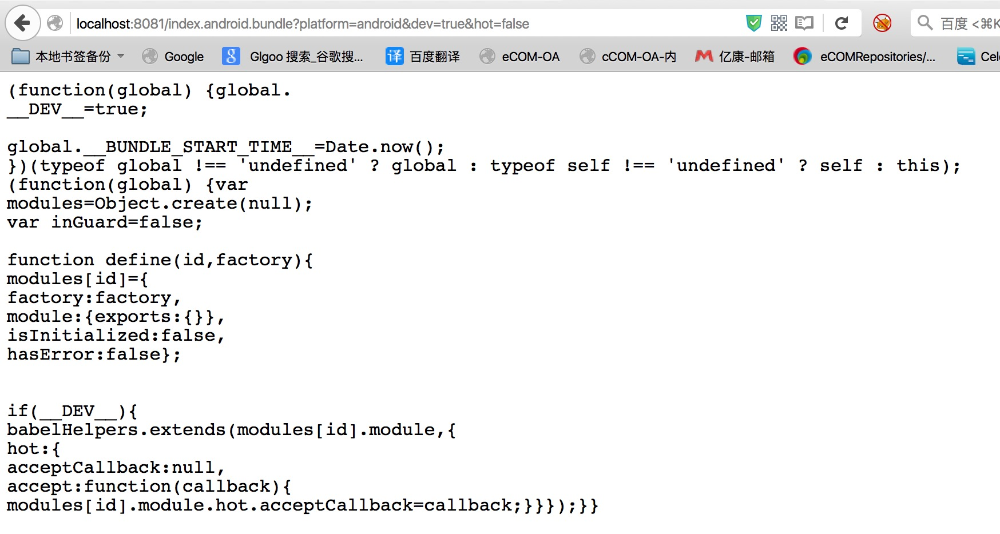
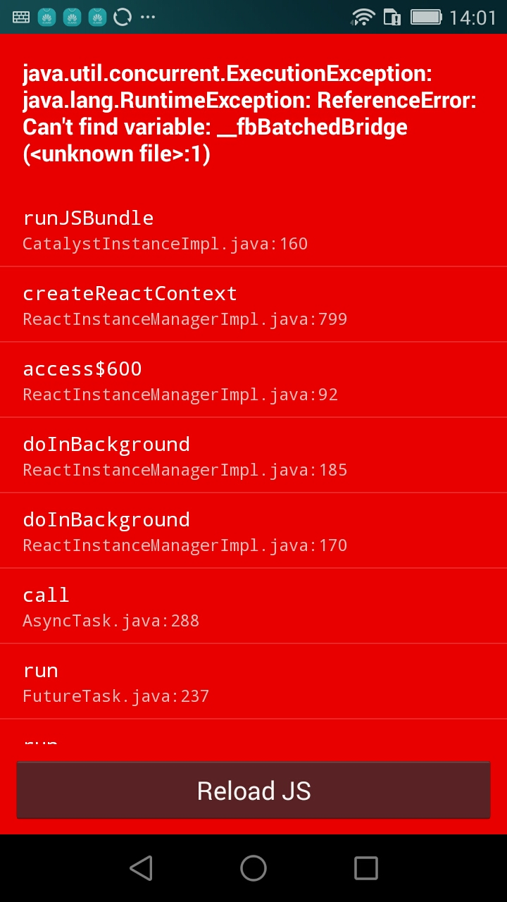
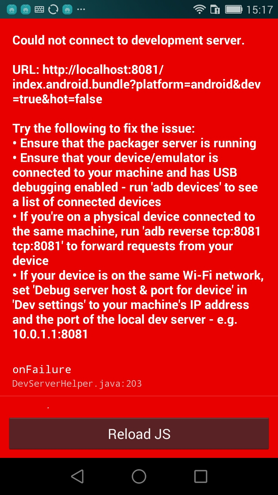
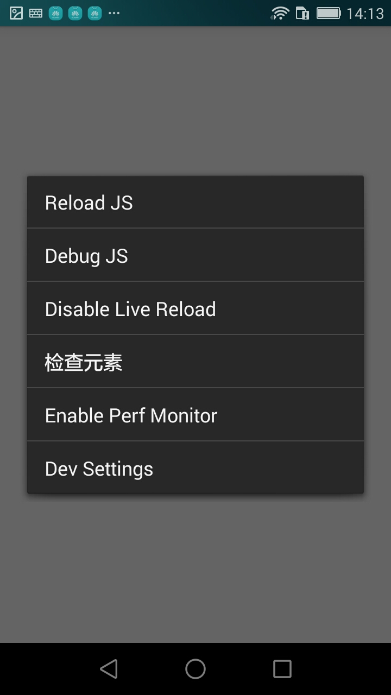
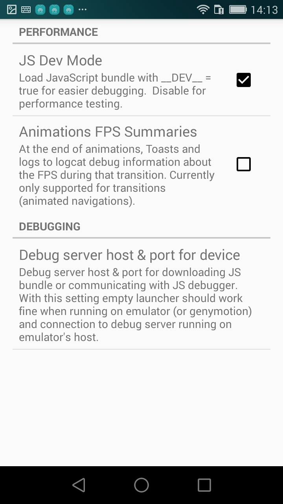
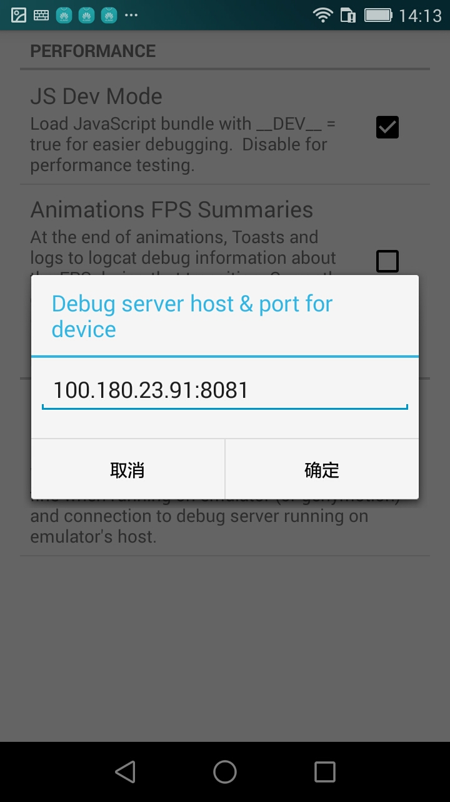
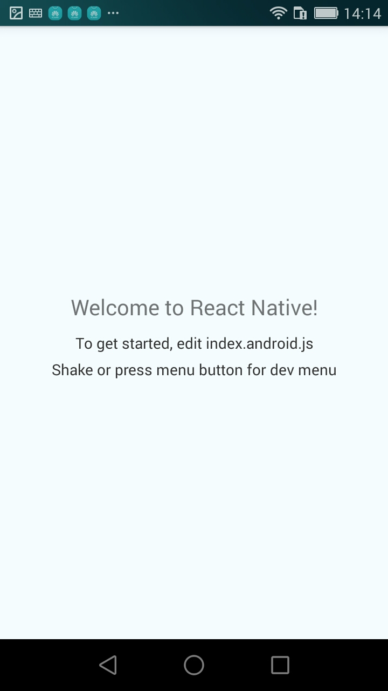
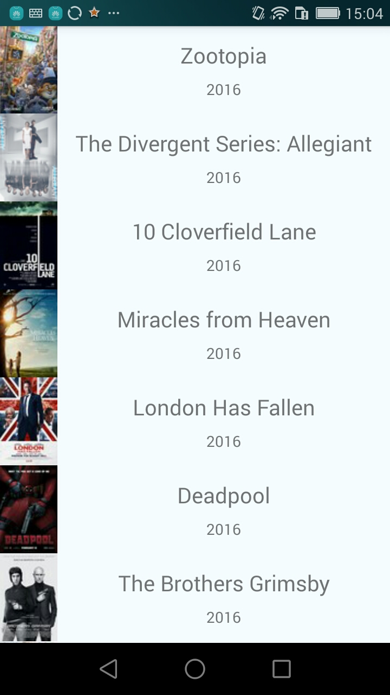

# ReactNativeDemo
学习ReactNative开发，搭建ReactNative第一个项目

****

# React Native 开发笔记

### 1、安装Homebrew

	$ /usr/bin/ruby -e "$(curl -fsSL https://raw.githubusercontent.com/Homebrew/install/master/install)"
	
### 2、安装wget、git、curl工具

	//每次执行brew命令时，最好先执行brew update 或者 brew upgrade 来保持上述几个程序为最新版本。
	$ brew update
	
	//接下来安装 wget 工具
	$ brew install wget
	
	//安装git指令执行的工具
	$ brew install git
	
	//安装curl工具
	$ brew install curl
	
### 3、安装npm工具，这时会自动安装node.js，并自动设置环境变量

	$ brew install npm
	
	//安装telnet命令，Mac OS自带有，不需要安装
	$ brew install telnet
	Error: No available formula with the name "telnet" 
	
	//安装bower、gulp构建js工具
	$ npm install gulp bower -g
	
	$ npm install gulp -g
	
	
	//安装好node.js，检查node.js和使用
	$ node
	> console.log("hello");
	hello
	> .exit
	
	
	//安装watchman，调试js的工具
	$ brew install watchman
	
	//安装flow，调试js的工具
	$ brew install flow
	
	//查看brew下安装了工具列表		
	$ brew list
	curl		git		openssl		watchman
	flow		node		pcre		wget

### 4、快速开始

###### 1、安装 React Native 组件 

React Native 需要一些在 开始 React Native 中阐明的基本的安装。
在完成了这些依赖项的安装之后，这里有两条可以为一个 React Native 项目完全准备好的命令。

    $ npm install -g react-native-cli
    
react-native-cli 是完成剩余安装的命令行工具。它是通过 npm 安装的。这将会在你的终端里面安装 react-native 这个命令行，你只需要做一次即可。
    
    $ react-native init ReactNativeDemo
    
    译注：由于众所周知的网络原因，react-native命令行从npm官方源拖代码时会遇上麻烦。请将npm仓库源替换为国内镜像：

	npm config set registry https://registry.npm.taobao.org
	npm config set disturl https://npm.taobao.org/dist

	另，执行init时切记不要在前面加上sudo（否则新项目的目录所有者会变为root而不是当前用户，导致一系列权限问题，请使用chown修复）。
	
###### 2、运行iOS应用 

    $ cd ReactNativeDemo
    
    用XCode打开ios/ReactNativeDemo.xcodeproj并点击Run按钮。
    使用你喜欢的文本编辑器打开index.ios.js并随便改上几行。
    在iOS Emulator中按下⌘-R就可以刷新APP并看到你的最新修改！

###### 3、运行Android应用 

    $ cd ReactNativeDemo
    $ react-native run-android
    
    使用你喜欢的文本编辑器打开index.android.js并随便改上几行
    按Menu键（通常是F2，在Genymotion模拟器中是⌘+M）然后选择 Reload JS 就可以看到你的最新修改。
    在终端下运行adb logcat *:S ReactNative:V ReactNativeJS:V可以看到你的应用的日志。
    
    
### 5、为已有的React Native工程添加Android支持

	如果你已经有了一个只有iOS版本的React Native工程，并且希望添加Android支持，你需要在你的工程目录下运行以下命令：
	打开package.json文件，在dependencies项中找到react-native，并将其后的版本号修改为最新版本。
	
    $ npm install
    $ react-native android
    
    
### 6、启动 watchman 服务

###### 查看 watchman 服务启动结果 

	在浏览器运行：
	http://localhost:8081/index.android.bundle?platform=android&dev=true&hot=false
	看看结果是不是下面效果，是则服务启动成功。
	

    
### 7、运行结果

###### 1、第一次运行手机肯定报错 
 
 
 
 
###### 2、这时候摇一摇手机，点击Dev Settings后，点击Debug server host & port for device,设置IP和端口 
 
 
 
 
###### 3、这里的IP是电脑的IP，不知道的可以在命令行中输入ipconfig进行查询，端口号固定8081 
 
 
 
###### 4、设置完成后，回到空白页面，再次摇一摇手机，选择Reload JS，程序就运行起来，出现Welcome to React Native！ 

 
 

###### 5、第一次运行React Native 项目结束。 

### 8、继续修改ReactNativeDemo项目

动态加载影视数据：http://api.rottentomatoes.com/api/public/v1.0/lists/movies/in_theaters.json

在项目中添加ListView控件，处理列表数据，以下是运行效果图

###### 1、android环境，直接运行下面指令即看效果

	$ react-native run-android
	

### 学习Facebook官方例子

UIExplorer 和 Movies 例子： [https://github.com/jiangqingbo/react-native-demo](https://github.com/jiangqingbo/react-native-demo)
	
	

